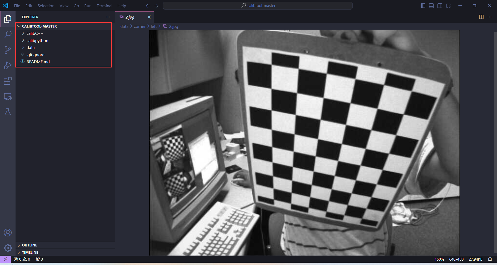

### 一、RGBD数据集
#### 1.标定
首先获取数据集包含rgb图像、红外图像和深度图像，示例的目录如下
```txt
- $root_dir
	- rgb
		- rgb1.png
		- rgb2.png
		- ...
	- depth
		- depth1.png
		- depth2.png
		- ...
```
其中 depthx.png 和 rgbx.png 图像必须是已经配准好了的。

#### 2.参数表
将其转换为 `orbslam3` 可以识别的`yaml`文件，其中需要修改的参数如下
* Camera1.fx x轴内参焦距
* Camera1.fy y轴内参焦距
* Camera1.cx x轴像素中心点
* Camera1.cy y轴像素中心点
* Camera1.k1 径向畸变参数
* Camera1.k2 径向畸变参数
* Camera1.p1 切向畸变参数
* Camera1.p2 切向畸变参数
* Camera1.k3 径向畸变参数
* Stereo.b 基线长，为向量 $t$ 的模
* RGBD.DepthMapFactor 深度映射的尺度因子，如果为m的话就是1000.0，mm就是1.0
* PointCloudMapping.Unit 单位尺度，m为1.0，mm为1000.00
这些可能需要厂商提供，或者是用图像配准算法计算，这个作者并不在行；一个具体的实例如下。
```yaml
%YAML:1.0

#--------------------------------------------------------------------------------------------
# Camera Parameters. Adjust them!
#--------------------------------------------------------------------------------------------
File.version: "1.0"

Camera.type: "PinHole"

# Camera calibration and distortion parameters (OpenCV)
# 修改，改成rgb图像的内参
Camera1.fx: 1.0330670202081678e+03
Camera1.fy: 1.0310455772701362e+03
Camera1.cx: 9.3046861250618576e+02
Camera1.cy: 5.3662586300152179e+02

# 修改，改成rgb图的畸变参数，默认无畸变
Camera1.k1: 0
Camera1.k2: 0
Camera1.p1: 0
Camera1.p2: 0
Camera1.k3: 0

# 修改，需要将其转换为图像的大小
Camera.width: 640
Camera.height: 480

# Camera frames per second 
Camera.fps: 30

# Color order of the images (0: BGR, 1: RGB. It is ignored if images are grayscale)
Camera.RGB: 1

# Close/Far threshold. Baseline times.
Stereo.ThDepth: 40.0
# 修改，基线长，是向量 t 的模
Stereo.b: 0.045

# 修改，如果是m的话就是1.0，如果是mm的话就是1000.0
# Depth map values factor
RGBD.DepthMapFactor: 1000.0


#--------------------------------------------------------------------------------------------
# ORB Parameters
#--------------------------------------------------------------------------------------------

# ORB Extractor: Number of features per image
ORBextractor.nFeatures: 1000

# ORB Extractor: Scale factor between levels in the scale pyramid 	
ORBextractor.scaleFactor: 1.2

# ORB Extractor: Number of levels in the scale pyramid	
ORBextractor.nLevels: 8

# ORB Extractor: Fast threshold
# Image is divided in a grid. At each cell FAST are extracted imposing a minimum response.
# Firstly we impose iniThFAST. If no corners are detected we impose a lower value minThFAST
# You can lower these values if your images have low contrast			
ORBextractor.iniThFAST: 20
ORBextractor.minThFAST: 7


# 不用修改
#--------------------------------------------------------------------------------------------
# Viewer Parameters
#--------------------------------------------------------------------------------------------
Viewer.KeyFrameSize: 0.05
Viewer.KeyFrameLineWidth: 1.0
Viewer.GraphLineWidth: 0.9
Viewer.PointSize: 2.0
Viewer.CameraSize: 0.08
Viewer.CameraLineWidth: 3.0
Viewer.ViewpointX: 0.0
Viewer.ViewpointY: -0.7
Viewer.ViewpointZ: -1.8
Viewer.ViewpointF: 500.0


#--------------------------------------------------------------------------------------------
# PointCloudMapping Parameters
#--------------------------------------------------------------------------------------------
PointCloudMapping.Resolution: 0.03  # voxel filter
PointCloudMapping.MeanK: 5.0  # outlier filter
PointCloudMapping.StdThresh: 1.0 # outlier filter
PointCloudMapping.Unit: 1.0 # mm(1000) or m(1) 
```

### 二、 双目数据集
双目数据集需要两种数据集，第一种是标定数据集，用于标定参数，第二种就是实际情况数据集。数据集格式如下
```txt 
- data
	- calib
		- left
			- leftcalib1.png
			- leftcalib2.png
			- ...
		- right
			- rightcalib1.png
			- rightcalib2.png
			- ...
	- left 
		- left1.png
		- left2.png
		- ...
	- right
		- right1.png
		- right2.png
		- ...
```
其中 data/calib/* 文件夹下的图像是用来标定的数据，而data/left和data/right 则是用于测试双目slam的原数据。
### 1.标定数据内参
这里推一下我的标定工具箱[https://github.com/5p6/calibtool](https://github.com/5p6/calibtool) ，工具箱的目录如下

其中工具箱分为C++和python两种版本，这里推荐使用python版本的标定工具，比较简单且好用。在工具箱中有更详细的介绍，这里只介绍创建双目数据集的标定，这里选用方格角点标定方式。标定板可以使用打印店板子打印，标定板的图像如下
![[Pasted image 20240523225119.png|350]]
先克隆仓库
```bash
git clone https://github.com/5p6/calibtool.git 
# 报错或者超时使用这个命令 git clone https://mirror.ghproxy.com/https://github.com/5p6/calibtool.git
# 转换分支
git checkout calibpython
```
先熟悉一下工具箱的帮助文档，再使用工具箱的相关功能，或者通过命令查看参数解释，标定板在标定的命令行如下。帮助文档命令
```shell 
# 获取帮助文档，一定要看，参数太多
python .\calibpython\stereocalib.py -h
```
一个简单的示例
```bash
# 示例
python .\calibpython\stereocalib.py -l ./data/calib/left -r ./data/calib/right -bs 7 6  -s 0.02 -rs 11 11 -sd 
```
参数解释如下
* -l 左目图像集路径
* -r 右目图像集路径
* -bs 棋盘格角点规格
* -s 棋盘格方格尺寸（圆格就是中间圆心之间的距离，这个是要用尺子测量的，一定要测量）
* -rs 亚角点查找半径（圆格不用管）
标定的部分结果如下
![[Pasted image 20240523224859.png]]
标定好的`yaml`文件默认路径为 `param/euroc.yaml`，其中的内容如下，假设你将该文件的路径转换到 ${path}/data.yaml。
![[Pasted image 20240523225739.png|450]]
其中 `K_l,K_r`分别为左右目的内参矩阵，`D_l,D_r`分别为左右目的畸变参数，`R,T` 为左目到右目的旋转矩阵和旋转向量，`Q` 就是重投影矩阵，将其转换为稠密重建的`yaml`文件的格式。但注意的是，在`yaml`文件中，转换矩阵`Stereo.T_c1_c2`和`R,T`的关系为

$$\begin{align}
  Stereo.T\_c1\_c2 &= \begin{bmatrix}
R & T \\
0^T & 1
\end{bmatrix}^{-1} \\
&= \begin{bmatrix}
R^T & -R^TT \\
0^T &1
\end{bmatrix}
\end{align}$$

其中用于转换的代码为 `convertT.py`
```python
import numpy as np
import cv2
import argparse
def main(args):
    file = cv2.FileStorage(args.input_path,cv2.FileStorage_READ)
    R = file.getNode("R").mat()
    t = file.getNode("T").mat()
    T = np.eye(4,4,dtype=np.float32)
    T[0:3,0:3] = R 
    T[0:3,3] = t 
    print(np.linalg.inv(T))

if __name__=="__main__":
    parser = argparse.ArgumentParser()
    parser.add_argument("-i","--input-path",default=None)
    args = parser.parse_args()
    main(args)
```
运行程序
```bash
python convertT.py -i ${path}/data.yaml
```
即可得到   `Stereo.T_c1_c2` （打印在终端）。将 data.yaml 文件的参数转换一下，将其转换为 `orbslam3` 可以识别的`yaml`文件，其中需要修改的参数如下
* Camera1
	* Camera1.fx 左相机x轴内参焦距 K_l[0,0]
	* Camera1.fy 左相机y轴内参焦距 K_l[1,1]
	* Camera1.cx 左相机x轴像素中心点 K_l[0,2]
	* Camera1.cy 左相机y轴像素中心点 K_l[1,2]
	* Camera1.k1 左相机径向畸变参数 D_l[0]
	* Camera1.k2 左相机径向畸变参数 D_l[1]
	* Camera1.p1 左相机切向畸变参数 D_l[2]
	* Camera1.p2 左相机切向畸变参数 D_l[3]
	* Camera1.k3 左相机径向畸变参数 D_l[4] (没有就不填)
* Camera2
	* Camera2.fx 左相机x轴内参焦距 K_r[0,0]
	* Camera2.fy 左相机y轴内参焦距 K_r[1,1]
	* Camera2.cx 左相机x轴像素中心点 K_r[0,2]
	* Camera2.cy 左相机y轴像素中心点 K_r[1,2]
	* Camera2.k1 左相机径向畸变参数 D_r[0]
	* Camera2.k2 左相机径向畸变参数 D_r[1]
	* Camera2.p1 左相机切向畸变参数 D_r[2]
	* Camera2.p2 左相机切向畸变参数 D_r[3]
	* Camera2.k3 左相机径向畸变参数 D_r[4] (没有就不填)
* Stereo.T_c1_c2 转换矩阵
* Stereo.Q 重投影矩阵，在data.yaml 里面有，复制一下就可以了。
* PointCloudMapping.Unit 单位尺度，m为1.0，mm为1000.00
一个示例文件如下

![[Pasted image 20240523231425.png]]
将`yaml`文件转换好后，就可以开始运行测试数据集了。
